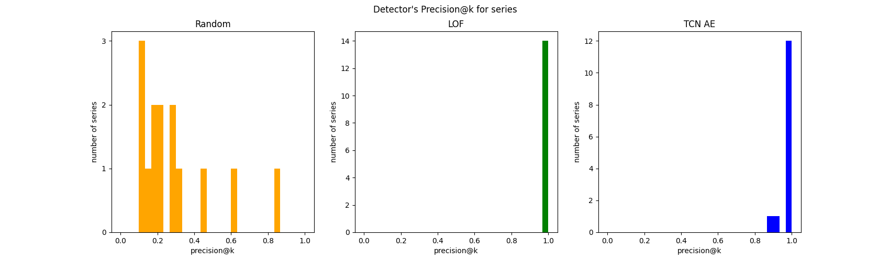
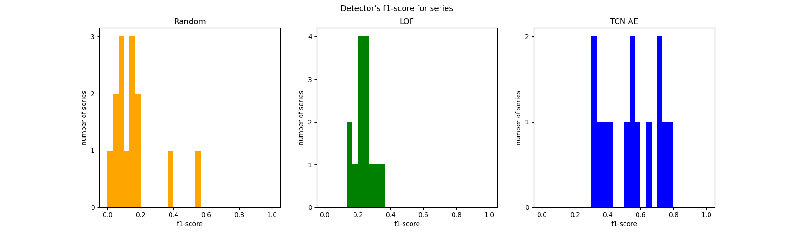

# Time-series-AD-with-TCN
Temporal Convolutional Neural Network in the time series anomaly detection task -
model implementation, experimental framework, experiment results.

---

## About the project

This repository presents an experiment on anomaly detection in time series using an autoencoder based on the
TCN neural network architecture. The task is **subsequence anomaly detection**, i.e. anomalies are some continuous
fragments of series, not just single values occurring on some single time steps. In this project,
the batch (offline) variant of detection is assumed.

In this repository, one can find:

- implementation of the anomaly detector, based on PyTorch, NumPy and SciPy
- basic framework for time series anomaly detection experiments
- evaluation results

#### My fork of `pytorch_tcn`

My implementation makes use of the [pytorch-tcn](https://pypi.org/project/pytorch-tcn/) library.
However, I have modified this library (added option to not use the padding) - see
[my fork](https://github.com/Hubert1225/pytorch-tcn).

## What is TCN?

Temporal Convolutional Network (TCN) is a variant of Convolutional Neural Network (CNN)
with some enhancements introduced for processing time series (temporal) data. In comparison
to the classical CNN, there are following differences:

- **causal convolutions** - convolutions that take only past and present values to compute
the value for the current moment; in the temporal context, it means that there is no
leakage of information from the future
- **dilation in convolutions** - in TCN, we use _dilated_ convolutions (kernel skips some values),
which significantly widen the network's perception field in a point of time
- **skip connections** the structure of a TCN network is not purely linear, there are some
additional connections between layers that are not direct neighbors

In TCN, we usually use padding in each convolutional layer so that the size of the output
is the same as the size of the input.

## Architecture

#### General architecture


#### Encoder's architecture


#### Decoder's architecture


## Dataset

For the purpose of testing the anomaly detection model, synthetic
_SinusRandomWalk_ (SRW) dataset has been used. It has been downloaded
from [this site](https://helios2.mi.parisdescartes.fr/~themisp/norma/).

Reference:

P. Boniol, M. Linardi, F. Roncallo, T. Palpanas, M. Meftah, E. Remy,
Unsupervised and Scalable Subsequence Anomaly Detection in Large Data Series,
VLDBJ (2021)

## Experiment details

We train a separate autoencoder instance for each time series.

In the experiment, we assume that number of anomalies and the anomaly length are
known in a given series. We check whether the model is able to locate them correctly.

For comparison purposes, we use two baseline methods:

- random detector - returns random subsequences
- Local Outlier Factor (LOF) - a well known anomaly detection method for multidimensional
data

We use two evaluation metrics:

- _precision@k_ - when the model return _k_ anomalies (anomalous subsequences),
the _precision@k_ is the fraction of detected subsequences that are correct
- _f1-score_ - f1-score metric computed for all points in the time series
(we ignore the context of subsequence in this case)

## How to run

First, you need to download data. Then, you need to train autoencoders
for time series. The training process is tracked with MLFlow.
Finally, you can run the evaluation and check results.

#### Prepare the environment

1. Navigate to the root of this repository
2. Create and turn on the Python virtual environment, if you like
3. Install the necessary dependencies:

```commandline
pip install -r requirements.txt
```

#### Download data

- **automatically** (needs a shell interpreting Linux commands)

Run the `download_srw.sh` script:

```bash
chmod +x data/download_srw.sh
./data/download_srw.sh
```

OR run manually the following commands:

```bash
mkdir data/srw
mkdir temp

wget https://helios2.mi.parisdescartes.fr/~themisp/norma/data/Synthetic_datasets.zip
unzip Synthetic_datasets.zip -d temp/
mv temp/Synthetic_Sin+anom/noNoise_varLenghtAnomalies/* data/srw/
mv temp/Synthetic_Sin+anom/noNoise_varNumberAnomalies/* data/srw/
mv temp/Synthetic_Sin+anom/varNoise_fixedNumberAnomaliesfixedLength/* data/srw/

rm -r temp/
rm Synthetic_datasets.zip
```

- **manually**:

Go to the site: https://helios2.mi.parisdescartes.fr/~themisp/norma/ .
Go to the `Synthetic Datasets` section, download the zip file. Create the `srw`
subdirectory in the `data` directory. Unpack the downloaded zip. Place
all .ts and annotations files in the `data/srw`.

#### Train autoencoders

Run the MLFlow server:

```commandline
mlflow server --backend-store-uri sqlite:///my.db
```

Then, you can run the training script:

```bash
PYTHONPATH=$(pwd)/src python3 train_models.py
```

(you can run just `python3 train_models.py` if you set the `PYTHONPATH` environment variable
to the `src` directory earlier or register the `src` as the source of modules in your IDE).

The training process is tracked with MLFlow (one series -> one autoencoder training -> 
one run in MLFlow). You can go to http://localhost:5000/ and see e.g. training time
for each time series and loss function graphs.


#### Evaluate detectors

In order to evaluate the detectors, run the `evaluation.ipynb` notebook.
Open the Jupyter Lab environment:

```bash
PYTHONPATH=$(pwd)/src jupyter lab
```

and run the `evaluation.ipynb` notebook.

## Results

**Mean precision@k per method for all time series**

```
Random    0.285595
LOF       0.997619
TCN AE    0.981548
```

**Mean f1-score per method for all time series**

```
Random    0.156837
LOF       0.238023
TCN AE    0.543618
```

If you want to see detailed results for each time series,
please see the `evaluation.ipynb` notebook.

Histograms of precision@k and f1-score per time series, for each method:





Results show, that the used benchmark dataset is an easy one in general - random
detector often achieves non-zero results, LOF and TCN detectors typically detect all
anomalies. Both TCN and LOF perform significantly better than the random detector.
However, we can see some differences in the LOF and TCN performance. TCN detector
missed a few more anomalies in comparison to LOF, but its precision in locating
anomalies was far better.
